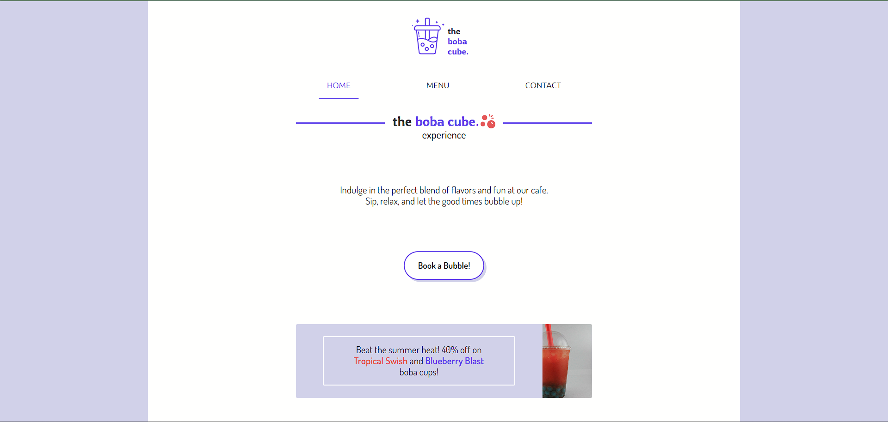

# Restaurant Page

This is the boba cube, a web application of a restaurant page which serves bubble teas. This has been implemented using HTML, CSS, JavaScript and Webpack, showcasing HTML content generation almost entirely using JavaScript DOM manipulation, and the power of **Webpack**.

Check it out :point_right:[here!](https://mell62.github.io/restaurant-page/):point_left:

## :mag: Features

- Multiple-tab browsing (Home, Menu, Contact)

## :tada: Achievements

- **Webpack** is utilized for the bundling of code of multiple files
- Multiple tab browsing made possible with the help of JavaScript and Webpack, where each tab is coded in its own JavaScript file
- Webpage generated almost entirely from JavaScript and barely any HTML

## :page_with_curl: Note

- Modern normalize is used for cross-browser consistency
